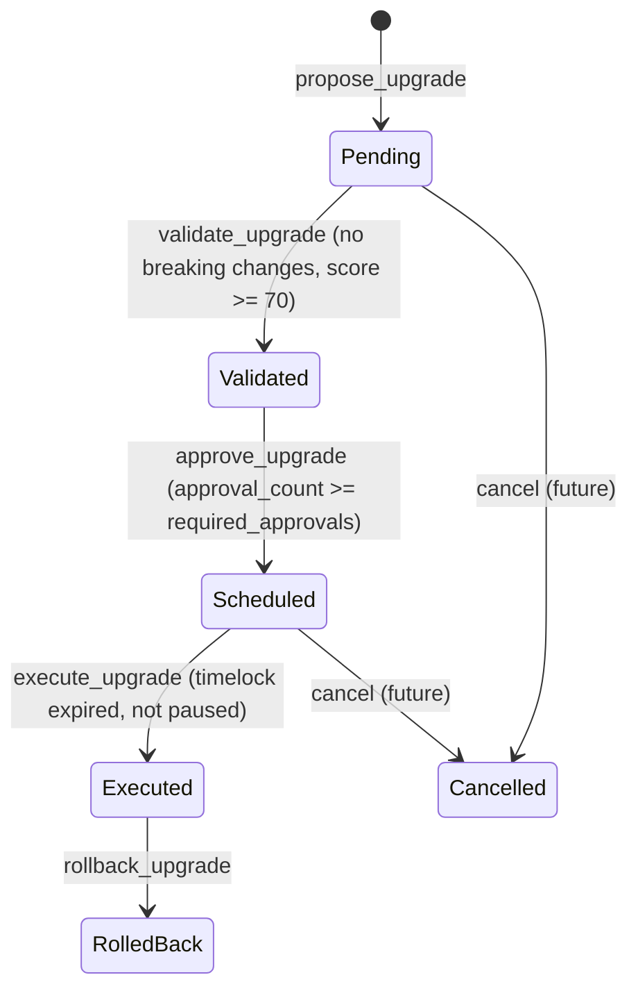

# Design Document: contracts-testing-suite

## Overview

This document covers the technical design for four interconnected deliverables on the ArenaX Soroban/Stellar smart contract platform:

1. **Analytics Contract** (`contracts/analytics`) — extended with full aggregation, privacy-preserving player behaviour recording, and access-audited reporting.
2. **Anti-Cheat Contract** (`contracts/anti-cheat`) — formalised with governance integration, cross-contract reputation penalties, and property-based test coverage.
3. **Upgrade System** (`contracts/upgrade-system`) — formalised with upgrade scheduling, compatibility checks, simulation environment, and notification hooks.
4. **Testing Infrastructure** (`contracts/testing-infrastructure`) — extended to cover all three contracts above with ≥95% line coverage, property-based tests, integration tests, gas benchmarks, and a complete CI/CD pipeline.

All contracts are written in Rust targeting Soroban SDK v23.5.2 and compiled to WASM for the Stellar network. The workspace root is `contracts/Cargo.toml`.

---

## Architecture

### System Overview

```mermaid
graph TD
    subgraph "On-Chain Contracts"
        AC[Analytics Contract]
        ATC[Anti-Cheat Contract]
        US[Upgrade System]
        GC[Governance / Multisig]
        MC[Match Contract\n(Reporter)]
        SC[Staking Contract\n(Reporter)]
    end

    subgraph "Testing Infrastructure"
        UT[Unit Tests\nper-contract src/test.rs]
        PT[Property Tests\ntesting-infrastructure/tests/fuzz_tests.rs]
        IT[Integration Tests\ntesting-infrastructure/tests/integration_tests.rs]
        BM[Gas Benchmarks\ntesting-infrastructure/benches/]
        CI[CI/CD Pipeline\n.github/workflows/test-suite.yml]
    end

    MC -->|record_match\nrecord_player_behaviour| AC
    SC -->|update_staked| AC
    MC -->|report_suspicious_activity| ATC
    GC -->|propose_upgrade\napprove_upgrade\nexecute_upgrade| US
    GC -->|update_anticheat_params\nset_emergency_mode| ATC
    US -->|emergency_pause| ATC
    US -->|emergency_pause| AC

    UT --> AC
    UT --> ATC
    UT --> US
    PT --> AC
    PT --> ATC
    PT --> US
    IT --> AC
    IT --> ATC
    IT --> US
    BM --> AC
    BM --> ATC
    BM --> US
    CI --> UT
    CI --> PT
    CI --> IT
    CI --> BM
```

### Key Design Decisions

**Privacy-first analytics**: Player addresses are never stored raw or emitted in events. All per-player data is keyed by `sha256(salt || address_bytes)`. The salt is set at initialisation and stored in instance storage.

**Monotonic upgrade status**: `UpgradeStatus` is represented as a `u32` with a strict ordering (`Pending=0 < Validated=1 < Scheduled=2 < Executed=3`). No function may decrease the status value of an existing proposal.

**CEI pattern in execute_upgrade**: The upgrade system marks a proposal as executed *before* performing the WASM hash swap to prevent re-entrancy.

**Persistent vs Instance storage**: Long-lived per-entity data (proposals, sanctions, reports, player behaviour) uses `persistent` storage. Global configuration and flags (admin, salt, paused, config) use `instance` storage for cheaper access.

**proptest for property tests**: The existing `Cargo.toml` already declares `proptest = "1.4"` as a dependency. All new property tests use `proptest` strategies. Each test runs a minimum of 100 iterations (proptest default is 256).

---

## Components and Interfaces

### Analytics Contract (`contracts/analytics`)

The contract is already substantially implemented. The design formalises the complete public interface.

#### Public Functions

| Function | Auth Required | Description |
|---|---|---|
| `initialize(admin, salt)` | admin | One-time setup; sets admin, salt, initial PlatformMetrics |
| `add_reporter(reporter)` | admin | Registers an authorised Reporter address |
| `remove_reporter(reporter)` | admin | Deregisters a Reporter address |
| `set_paused(paused)` | admin | Toggles the paused flag |
| `record_match(reporter, game_id, match_id, duration_secs, wager_amount, reward_amount, player_count)` | reporter | Records a completed match; updates GameMetrics and PlatformMetrics |
| `record_player_behaviour(reporter, player, game_id, won, session_secs)` | reporter | Records per-player behaviour under hashed key |
| `update_staked(reporter, total_staked)` | reporter | Updates PlatformMetrics.total_staked |
| `get_game_metrics(game_id)` | none | Returns `Option<GameMetrics>` |
| `get_platform_metrics()` | none | Returns current `PlatformMetrics` |
| `get_player_behaviour(caller, player)` | caller (admin or player) | Returns `Option<PlayerBehaviourSnapshot>` |
| `get_admin()` | none | Returns admin address |

#### Events

| Symbol | Topics | Data | Privacy |
|---|---|---|---|
| `MATCH_REC` | `(game_id, match_id)` | `(duration_secs, wager_amount, reward_amount, player_count)` | No addresses |
| `PLR_BEH` | `(player_hash)` | `(game_id, won, session_secs)` | Hashed only |


### Anti-Cheat Contract (`contracts/anti-cheat`)

#### Public Functions

| Function | Auth Required | Description |
|---|---|---|
| `initialize(admin, reputation_contract)` | — | One-time setup |
| `report_suspicious_activity(reporter, player, match_id, pattern, evidence, severity, anonymous)` | — | Submits a cheat report; validates severity [1–10] and cooldown |
| `validate_game_action(player, action, game_state)` | — | Returns bool; performs deep validation for low-trust players |
| `calculate_cheat_probability(player, behavior_data)` | — | Returns u32 [0–100] cheat probability |
| `apply_sanction(player, sanction_type, reason, duration, report_ids)` | admin | Creates a Sanction record |
| `appeal_sanction(player, sanction_id, reason, evidence)` | player | Creates an Appeal; updates Sanction status to Appealed |
| `review_appeal(appeal_id, approved)` | admin | Approves or upholds an appeal; restores/confirms trust score |
| `verify_activity(caller, report_id, verified)` | admin | Marks a report verified; auto-applies sanction if true |
| `get_player_trust_score(player)` | — | Returns TrustScore (default score=100 for new players) |
| `get_report(report_id)` | — | Returns SuspiciousActivity |
| `get_sanction(sanction_id)` | — | Returns Sanction |
| `get_appeal(appeal_id)` | — | Returns Appeal |
| `update_anticheat_params(caller, params)` | admin (caller check) | Updates AntiCheatParams |
| `set_emergency_mode(enabled)` | admin | Updates EmergencyMode key and params.emergency_mode |
| `set_governance_contract(governance)` | admin | Registers governance contract address |
| `get_analytics()` | — | Returns AnalyticsData |
| `get_behavior_profile(player)` | — | Returns `Option<BehaviorProfile>` |
| `get_whistleblower_protection(reporter)` | — | Returns `Option<WhistleblowerProtection>` |

#### Trust Score Penalty Formula

```
unverified_penalty = min(severity * confidence_score / 100, 10)
confirmed_penalty  = min(severity * 5 * confidence_score / 100, 50)
new_score          = current_score.saturating_sub(penalty)   // never below 0
```

Appeal approval restores: `new_score = min(current_score + 30, 100)`

### Upgrade System (`contracts/upgrade-system`)

#### Public Functions

| Function | Auth Required | Description |
|---|---|---|
| `initialize(governance_address, min_timelock_duration, required_approvals, emergency_threshold)` | — | One-time setup |
| `propose_upgrade(proposer, proposal_id, params)` | governance | Creates a Pending proposal |
| `validate_upgrade(validator, proposal_id, compatibility_score, breaking_changes, security_issues)` | governance | Validates proposal; moves to Validated |
| `approve_upgrade(approver, proposal_id, signature_hash)` | governance | Adds approval; moves to Scheduled when threshold reached |
| `execute_upgrade(executor, proposal_id)` | governance | Executes after timelock; adds history entry |
| `rollback_upgrade(initiator, contract_address, reason)` | governance | Restores previous WASM hash |
| `emergency_pause(caller, contract_address, reason)` | governance | Sets EmergencyState.is_paused=true |
| `unpause_contract(caller, contract_address)` | governance | Sets EmergencyState.is_paused=false |
| `get_proposal(proposal_id)` | — | Returns UpgradeProposal |
| `get_validation(proposal_id)` | — | Returns ValidationResult |
| `get_upgrade_history(contract_address)` | — | Returns Vec<UpgradeHistoryEntry> |
| `get_emergency_state(contract_address)` | — | Returns EmergencyState |
| `get_approvals(proposal_id)` | — | Returns Vec<ApprovalRecord> |
| `get_config()` | — | Returns UpgradeConfig |

#### Proposal Status State Machine



Status values are stored as `u32` with strict ordering. No transition may decrease the numeric value of a proposal's status.

---

## Data Models

### Analytics Contract Storage

| Key | Storage Type | Value Type | Description |
|---|---|---|---|
| `DataKey::Admin` | instance | `Address` | Contract administrator |
| `DataKey::Salt` | instance | `BytesN<32>` | Privacy salt for address hashing |
| `DataKey::Paused` | instance | `bool` | Pause flag |
| `DataKey::Platform` | instance | `PlatformMetrics` | Global platform counters |
| `DataKey::AuthReporter(Address)` | instance | `bool` | Authorised reporter registry |
| `DataKey::GameMetrics(u32)` | persistent | `GameMetrics` | Per-game aggregated metrics |
| `DataKey::PlayerBehaviour(BytesN<32>)` | persistent | `PlayerBehaviourSnapshot` | Per-player behaviour (keyed by hash) |

**GameMetrics**
```rust
pub struct GameMetrics {
    pub game_id: u32,
    pub total_matches: u64,
    pub total_players: u64,
    pub total_wagered: i128,
    pub total_rewards_paid: i128,
    pub avg_match_duration_secs: u64,  // rolling average
    pub last_updated: u64,
}
```

**PlatformMetrics**
```rust
pub struct PlatformMetrics {
    pub total_matches_all_time: u64,
    pub active_players_30d: u64,
    pub total_staked: i128,
    pub total_volume: i128,   // sum of all wager_amounts
    pub last_updated: u64,
}
```

**PlayerBehaviourSnapshot** (stored under `sha256(salt || address_bytes)`)
```rust
pub struct PlayerBehaviourSnapshot {
    pub player_hash: BytesN<32>,
    pub game_id: u32,
    pub matches_played: u64,
    pub wins: u64,
    pub losses: u64,
    pub avg_session_secs: u64,   // rolling average
    pub last_seen_bucket: u64,   // Unix timestamp rounded to nearest day
}
```

### Anti-Cheat Contract Storage

| Key | Storage Type | Value Type |
|---|---|---|
| `DataKey::Admin` | persistent | `Address` |
| `DataKey::AntiCheatParams` | persistent | `AntiCheatParams` |
| `DataKey::EmergencyMode` | persistent | `bool` |
| `DataKey::ReportCounter` | persistent | `u64` |
| `DataKey::SanctionCounter` | persistent | `u64` |
| `DataKey::AppealCounter` | persistent | `u64` |
| `DataKey::Report(u64)` | persistent | `SuspiciousActivity` |
| `DataKey::Sanction(u64)` | persistent | `Sanction` |
| `DataKey::Appeal(u64)` | persistent | `Appeal` |
| `DataKey::TrustScore(Address)` | persistent | `TrustScore` |
| `DataKey::PlayerReports(Address, u64)` | persistent | `u64` (last report timestamp) |
| `DataKey::WhistleblowerProtection(Address)` | persistent | `WhistleblowerProtection` |
| `DataKey::BehaviorProfile(Address)` | persistent | `BehaviorProfile` |

### Upgrade System Storage

| Key | Storage Type | Value Type |
|---|---|---|
| `DataKey::Initialized` | instance | `bool` |
| `DataKey::Config` | instance | `UpgradeConfig` |
| `DataKey::Proposal(BytesN<32>)` | persistent | `UpgradeProposal` |
| `DataKey::Validation(BytesN<32>)` | persistent | `ValidationResult` |
| `DataKey::Approvals(BytesN<32>)` | persistent | `Vec<ApprovalRecord>` |
| `DataKey::History(Address)` | persistent | `Vec<UpgradeHistoryEntry>` |
| `DataKey::Rollback(Address)` | persistent | `RollbackInfo` |
| `DataKey::EmergencyState(Address)` | persistent | `EmergencyState` |
| `DataKey::ProposalExecuted(BytesN<32>)` | persistent | `bool` (replay protection) |
| `DataKey::ContractCurrentHash(Address)` | persistent | `BytesN<32>` |

**UpgradeStatus ordering** (monotonic invariant):
```
Pending(0) < Validated(1) < Scheduled(2) < Executed(3) < RolledBack(4)
```

---

## Correctness Properties

*A property is a characteristic or behavior that should hold true across all valid executions of a system — essentially, a formal statement about what the system should do. Properties serve as the bridge between human-readable specifications and machine-verifiable correctness guarantees.*

---

### Property 1: Token Conservation (Volume Accumulation)

*For any* sequence of N `record_match` calls with wager amounts `w_1, w_2, ..., w_N`, the value of `PlatformMetrics.total_volume` after all calls must equal `w_1 + w_2 + ... + w_N`.

**Validates: Requirements 1.2, 10.1**

---

### Property 2: Rolling Average Correctness

*For any* sequence of `record_match` calls for the same `game_id`, the stored `GameMetrics.avg_match_duration_secs` must equal the arithmetic mean of all `duration_secs` values submitted for that game.

**Validates: Requirements 1.1**

---

### Property 3: Events Never Contain Raw Player Addresses

*For any* call to `record_match` or `record_player_behaviour`, none of the emitted event topics or data values may be equal to the raw `player` `Address` passed as input. The `PLR_BEH` event must contain only the `BytesN<32>` hash.

**Validates: Requirements 1.5, 2.3**

---

### Property 4: Player Data Stored Under Hash, Not Raw Address

*For any* player `Address` and contract salt, after a `record_player_behaviour` call, the persistent storage must contain an entry keyed by `DataKey::PlayerBehaviour(sha256(salt || address_bytes))` and must not contain any entry keyed by the raw address.

**Validates: Requirements 2.1**

---

### Property 5: Player Behaviour Access Control

*For any* caller address that is neither the admin nor the player themselves, a call to `get_player_behaviour` must panic with "not authorised".

**Validates: Requirements 2.4, 2.5**

---

### Property 6: Admin-Only Mutation Functions Reject Non-Admin Callers

*For any* address that is not the registered admin, calls to `add_reporter`, `remove_reporter`, and `set_paused` must fail with an authentication error.

**Validates: Requirements 3.4, 3.5, 3.6**

---

### Property 7: Paused Contract Rejects All State-Mutating Calls

*For any* state-mutating call (`record_match`, `record_player_behaviour`, `update_staked`) made while the Analytics Contract is paused, the contract must panic with "contract is paused".

**Validates: Requirements 1.4**

---

### Property 8: Severity Validation Rejects Out-of-Range Values

*For any* severity value `s` where `s == 0` or `s > 10`, a call to `report_suspicious_activity` must panic with "invalid severity".

**Validates: Requirements 4.1, 9.5**

---

### Property 9: Report Cooldown Enforcement

*For any* `(reporter, player, match_id)` triple, if `report_suspicious_activity` is called a second time within `report_cooldown` seconds of the first call, the second call must panic with "report cooldown not met".

**Validates: Requirements 4.2**

---

### Property 10: Trust Score Bounds Invariant

*For any* sequence of `report_suspicious_activity`, `apply_sanction`, and `review_appeal` calls applied to a player, the player's `Trust_Score` must always remain in the range `[0, 100]` inclusive.

**Validates: Requirements 6.2, 6.3, 5.6, 10.2**

---

### Property 11: New Player Trust Score Defaults to 100

*For any* player `Address` that has never had a trust score recorded, `get_player_trust_score` must return a `TrustScore` with `score == 100`.

**Validates: Requirements 6.1**

---

### Property 12: Emergency Mode Consistency

*For any* call to `set_emergency_mode(enabled)`, both `DataKey::EmergencyMode` in persistent storage and `AntiCheatParams.emergency_mode` must be set to `enabled` after the call.

**Validates: Requirements 6.6**

---

### Property 13: AntiCheatParams Update Idempotence

*For any* `AntiCheatParams` value `p`, calling `update_anticheat_params` with `p` twice must produce the same stored state as calling it once.

**Validates: Requirements 10.6**

---

### Property 14: Upgrade Proposal Timelock Validation

*For any* `timelock_duration` value strictly less than `min_timelock_duration`, a call to `propose_upgrade` must return `Err(UpgradeError::TimelockTooShort)`.

**Validates: Requirements 7.1**

---

### Property 15: Proposal ID Uniqueness

*For any* `proposal_id` that already exists in storage, a second call to `propose_upgrade` with the same `proposal_id` must return `Err(UpgradeError::ProposalAlreadyExists)`.

**Validates: Requirements 7.2**

---

### Property 16: Proposal Timelock End Correctness

*For any* valid `propose_upgrade` call with `timelock_duration` `d` submitted at ledger timestamp `t`, the stored proposal must have `timelock_end == t + d` and `status == Pending`.

**Validates: Requirements 7.3**

---

### Property 17: Validation Rejects Invalid Inputs

*For any* combination of `(breaking_changes=true)`, `(security_issues non-empty)`, or `(compatibility_score < 70)`, a call to `validate_upgrade` must return the corresponding validation error (`BreakingChangesDetected`, `SecurityIssuesFound`, or `IncompatibleUpgrade`).

**Validates: Requirements 7.4**

---

### Property 18: Approval Threshold Triggers Scheduling

*For any* proposal that has been validated, after exactly `required_approvals` distinct approvals, the proposal status must be `Scheduled`.

**Validates: Requirements 7.6**

---

### Property 19: Duplicate Approval Rejected

*For any* approver address that has already approved a given proposal, a second `approve_upgrade` call from the same address must return `Err(UpgradeError::AlreadyApproved)`.

**Validates: Requirements 7.7**

---

### Property 20: Timelock Enforcement on Execution

*For any* `execute_upgrade` call made at ledger timestamp `t` where `t < proposal.timelock_end`, the call must return `Err(UpgradeError::TimelockNotExpired)`.

**Validates: Requirements 8.1**

---

### Property 21: Replay Protection on Execution

*For any* proposal that has already been executed, a second call to `execute_upgrade` must return `Err(UpgradeError::ProposalAlreadyExecuted)`.

**Validates: Requirements 8.2**

---

### Property 22: Execution Adds History Entry

*For any* successful `execute_upgrade` call, `get_upgrade_history(contract_address)` must return a list containing an entry with `success=true` and `new_wasm_hash` matching the proposal's `new_wasm_hash`.

**Validates: Requirements 8.4**

---

### Property 23: Proposal Status Monotonicity

*For any* upgrade proposal, the sequence of status values observed over time must be strictly non-decreasing according to the ordering `Pending(0) < Validated(1) < Scheduled(2) < Executed(3)`. No operation may move a proposal to a numerically lower status.

**Validates: Requirements 10.3**

---

### Property 24: Pause/Unpause Round-Trip

*For any* contract address, calling `emergency_pause` followed by `unpause_contract` must result in `EmergencyState.is_paused == false`, restoring the contract to its pre-pause operational state.

**Validates: Requirements 8.7, 8.8**

---

### Property 25: XDR Serialisation Round-Trip

*For any* valid instance of `GameMetrics`, `PlayerBehaviourSnapshot`, `Sanction`, or `UpgradeProposal`, serialising the value via the Soroban XDR codec and then deserialising it must produce a value equal to the original.

**Validates: Requirements 10.4**

---

### Property 26: No Unexpected Panics on Arbitrary Bytes Input

*For any* `Bytes` value passed as `evidence` to `report_suspicious_activity` or as `action`/`game_state` to `validate_game_action`, the function must either return a documented result or panic with a documented error message. It must never panic with an unhandled/unexpected error.

**Validates: Requirements 10.5**

---

## Error Handling

### Analytics Contract

| Condition | Behaviour |
|---|---|
| `initialize` called twice | `panic!("already initialized")` |
| State-mutating call while paused | `panic!("contract is paused")` |
| `record_match` / `record_player_behaviour` by non-reporter | `panic!("not an authorised reporter")` |
| `get_player_behaviour` by unauthorised caller | `panic!("not authorised")` |
| `add_reporter` / `remove_reporter` / `set_paused` by non-admin | Soroban auth failure (require_auth panics) |

### Anti-Cheat Contract

| Condition | Behaviour |
|---|---|
| `initialize` called twice | `panic!("already initialized")` |
| `report_suspicious_activity` with severity outside [1,10] | `panic!("invalid severity")` |
| `report_suspicious_activity` within cooldown window | `panic!("report cooldown not met")` |
| `apply_sanction` by non-admin | Soroban auth failure |
| `appeal_sanction` by wrong player | `panic!("not your sanction")` |
| `appeal_sanction` after deadline | `panic!("appeal deadline passed")` |
| `review_appeal` on already-reviewed appeal | `panic!("appeal already reviewed")` |
| `update_anticheat_params` by non-admin | `panic!("only admin can update parameters")` |
| `verify_activity` by non-admin | `panic!("only admin can verify activity")` |

### Upgrade System

All error conditions return typed `Result<_, UpgradeError>` variants rather than panicking, enabling callers to handle errors programmatically.

| Condition | Error Variant |
|---|---|
| `initialize` called twice | `AlreadyInitialized` |
| `propose_upgrade` with timelock < min | `TimelockTooShort` |
| `propose_upgrade` with duplicate ID | `ProposalAlreadyExists` |
| `validate_upgrade` with breaking changes | `BreakingChangesDetected` |
| `validate_upgrade` with security issues | `SecurityIssuesFound` |
| `validate_upgrade` with score < 70 | `IncompatibleUpgrade` |
| `approve_upgrade` by already-approved address | `AlreadyApproved` |
| `execute_upgrade` before timelock | `TimelockNotExpired` |
| `execute_upgrade` on executed proposal | `ProposalAlreadyExecuted` |
| `execute_upgrade` on paused contract | `ContractPaused` |
| `rollback_upgrade` with no prior upgrade | `NoRollbackAvailable` |
| Any governance function by non-governance address | `NotGovernance` |

### Cross-Contract Error Propagation

When the Upgrade System calls `emergency_pause` on the Analytics or Anti-Cheat contracts, errors from those contracts propagate as Soroban host errors. Integration tests must verify that a paused Analytics Contract correctly rejects `record_match` calls even when the pause was initiated by the Upgrade System.

---

## Testing Strategy

### Dual Testing Approach

Unit tests and property-based tests are complementary and both required:

- **Unit tests** (`src/test.rs` in each contract crate): verify specific examples, exact error messages, event emission, and edge cases.
- **Property tests** (`contracts/testing-infrastructure/tests/fuzz_tests.rs`): verify universal properties across hundreds of generated inputs using `proptest`.

Unit tests should focus on concrete scenarios; avoid duplicating what property tests already cover broadly.

### Unit Test Structure

Each contract crate contains a `src/test.rs` module. Tests follow the pattern established in `contracts/anti-cheat/src/test.rs` and `contracts/upgrade-system/src/test.rs`:

```rust
#[cfg(test)]
mod test {
    use soroban_sdk::{testutils::Address as _, Env};
    use crate::ContractClient;

    fn setup() -> (Env, ContractClient) {
        let env = Env::default();
        env.mock_all_auths();
        let id = env.register(Contract, ());
        let client = ContractClient::new(&env, &id);
        (env, client)
    }

    #[test]
    fn test_success_path() { /* ... */ }

    #[test]
    #[should_panic(expected = "exact panic message")]
    fn test_error_condition() { /* ... */ }
}
```

**Required unit test coverage per contract:**

*Analytics Contract:*
- `initialize` success and double-init panic
- `add_reporter` / `remove_reporter` success and non-admin rejection
- `record_match` success, non-reporter rejection, paused rejection, event emission
- `record_player_behaviour` success, privacy (no raw address in storage), event emission
- `get_player_behaviour` admin access, player self-access, unauthorised rejection
- `set_paused` toggle; verify all mutating calls blocked when paused
- `get_platform_metrics` / `get_game_metrics` view functions
- Edge cases: `player_count=0`, `wager_amount=0`, `duration_secs=0`

*Anti-Cheat Contract:*
- All existing tests in `src/test.rs` (already present)
- Additional: `severity=1` (boundary), `severity=10` (boundary), `severity=11` (rejection)
- `appeal_sanction` after deadline (rejection)
- `review_appeal` twice (rejection)
- Trust score at 0 (no underflow), trust score at 100 (no overflow on restore)
- Emergency mode auto-verify path (confidence > 80)

*Upgrade System:*
- All existing tests in `src/test.rs` (already present)
- Additional: `timelock_duration == min_timelock_duration` (boundary, must succeed)
- Full lifecycle: propose → validate → approve × N → execute → verify history
- `rollback_upgrade` with and without prior upgrade
- `emergency_pause` then `execute_upgrade` (must return `ContractPaused`)

### Property-Based Test Configuration

Library: `proptest = "1.4"` (already in `Cargo.toml`)

Each property test must:
1. Run a minimum of 100 iterations (proptest default is 256, which satisfies this)
2. Include a comment referencing the design property it validates
3. Use the tag format: `// Feature: contracts-testing-suite, Property N: <property_text>`

**Property test file**: `contracts/testing-infrastructure/tests/fuzz_tests.rs`

The existing file contains placeholder `proptest!` blocks. These must be replaced with concrete implementations targeting the three contracts.

Example structure for Property 1 (Token Conservation):

```rust
// Feature: contracts-testing-suite, Property 1: Token Conservation
proptest! {
    #[test]
    fn prop_token_conservation(
        wager_amounts in prop::collection::vec(0i128..1_000_000_000i128, 1..50)
    ) {
        let env = Env::default();
        env.mock_all_auths();
        let contract_id = env.register(AnalyticsContract, ());
        let client = AnalyticsContractClient::new(&env, &contract_id);
        let admin = Address::generate(&env);
        let reporter = Address::generate(&env);
        let salt = BytesN::from_array(&env, &[1u8; 32]);
        client.initialize(&admin, &salt);
        client.add_reporter(&reporter);

        let expected_total: i128 = wager_amounts.iter().sum();
        for (i, &wager) in wager_amounts.iter().enumerate() {
            let match_id = BytesN::from_array(&env, &[i as u8; 32]);
            client.record_match(&reporter, &1u32, &match_id, &300u64, &wager, &wager, &2u32);
        }
        let metrics = client.get_platform_metrics();
        prop_assert_eq!(metrics.total_volume, expected_total);
    }
}
```

### Integration Test Structure

File: `contracts/testing-infrastructure/tests/integration_tests.rs`

The existing file contains commented-out placeholder tests. The following concrete integration tests must be implemented:

**IT-1: Analytics + Mock Reporter (Req 11.1)**
Deploy `AnalyticsContract` and a mock reporter contract. Call `record_match` 10 times. Assert `total_matches_all_time == 10`.

**IT-2: Anti-Cheat + Upgrade System pause interaction (Req 11.2)**
Deploy both contracts. Pause the Anti-Cheat contract via `UpgradeSystem.emergency_pause`. Attempt `execute_upgrade` — must return `ContractPaused`. Call `unpause_contract`. Retry `execute_upgrade` — must succeed (after timelock).

**IT-3: Full upgrade lifecycle (Req 11.3)**
`propose_upgrade` → `validate_upgrade` → `approve_upgrade` × `required_approvals` → advance ledger past `timelock_end` → `execute_upgrade` → assert `get_upgrade_history` contains entry with `success=true`.

**IT-4: Full anti-cheat sanction lifecycle (Req 11.4)**
`report_suspicious_activity` → `verify_activity` → `apply_sanction` → `appeal_sanction` → `review_appeal(approved=true)` → assert trust score increased by 30 (capped at 100).

**IT-5: Analytics unauthorised reporter rejection (Req 11.5)**
Deploy `AnalyticsContract`. Call `record_match` from an address not registered as a reporter. Assert panic with "not an authorised reporter".

### Gas Benchmarks

File: `contracts/testing-infrastructure/benches/gas_benchmarks.rs`

The existing file benchmarks generic operations. The following named benchmarks must be added for the three target contracts:

| Benchmark Name | Function |
|---|---|
| `bench_record_match` | `AnalyticsContract::record_match` |
| `bench_record_player_behaviour` | `AnalyticsContract::record_player_behaviour` |
| `bench_report_suspicious_activity` | `AntiCheatContract::report_suspicious_activity` |
| `bench_apply_sanction` | `AntiCheatContract::apply_sanction` |
| `bench_propose_upgrade` | `UpgradeSystem::propose_upgrade` |
| `bench_validate_upgrade` | `UpgradeSystem::validate_upgrade` |
| `bench_approve_upgrade` | `UpgradeSystem::approve_upgrade` |
| `bench_execute_upgrade` | `UpgradeSystem::execute_upgrade` |

Each benchmark uses `criterion::black_box` and reports CPU instruction counts via `env.budget().cpu_instruction_cost()`.

### CI/CD Pipeline

File: `contracts/testing-infrastructure/.github/workflows/test-suite.yml`

The existing workflow is largely complete. Required additions and fixes:

1. **Coverage tool**: Replace `cargo-tarpaulin` with `cargo-llvm-cov` (as specified in requirements). Add `llvm-tools-preview` component to the Rust toolchain step.

2. **Coverage threshold enforcement**: The coverage job must fail if any contract falls below 95% line coverage:
   ```yaml
   - name: Check coverage threshold
     run: |
       cd contracts
       cargo llvm-cov --workspace --lcov --output-path lcov.info
       cargo llvm-cov report --fail-under-lines 95
   ```

3. **Clippy as mandatory gate**: The existing `lint` job runs `cargo clippy -- -D warnings`. This must be a dependency of the `unit-tests` job so it blocks the pipeline.

4. **cargo audit gate**: The existing `security-scan` job runs `cargo audit`. This must also be a dependency of `unit-tests`.

5. **Nightly security scan**: The existing `schedule` trigger at `0 2 * * *` already covers this. The `security-scan` job must add `cargo-geiger` for unsafe code detection, running only on the scheduled trigger:
   ```yaml
   - name: Run cargo geiger (nightly only)
     if: github.event_name == 'schedule'
     run: cargo geiger --workspace
   ```

6. **Benchmark artifact**: The `benchmarks` job must upload Criterion output as an artifact named `benchmark-results` on every successful run (already present in the existing workflow).

7. **Coverage artifact**: The `coverage` job must upload the `lcov.info` report as an artifact named `coverage-report` (update from tarpaulin HTML to llvm-cov lcov format).

---

## Cross-Contract Interaction Patterns

### Analytics ← Match/Staking Contracts

Match contracts call `record_match` and `record_player_behaviour` as authorised Reporters. The Analytics Contract validates the reporter's address against the `AuthReporter` registry on every call. No cross-contract call is made back to the reporter.

### Anti-Cheat ← Match Contracts

Match contracts may call `report_suspicious_activity` directly. The Anti-Cheat Contract does not require the reporter to be pre-registered; any address may submit a report (subject to cooldown). The `anonymous` flag controls whether a `WhistleblowerProtection` record is created.

### Upgrade System → Target Contracts (Emergency Pause)

The Upgrade System stores `EmergencyState` for each target contract address in its own storage. It does not make cross-contract calls to pause other contracts — instead, each contract is expected to query the Upgrade System's emergency state before executing state-mutating operations, or the Upgrade System's `emergency_pause` event is observed off-chain and the target contract's own `set_paused` function is called by the admin.

For the integration test (IT-2), the simpler approach is: the Upgrade System's `execute_upgrade` checks its own `EmergencyState` for the target contract address. This is already implemented in `execute_upgrade` via `storage::get_emergency_state`.

### Governance → Anti-Cheat / Upgrade System

The Governance multisig contract calls `update_anticheat_params` and `set_emergency_mode` on the Anti-Cheat Contract, and `propose_upgrade` / `approve_upgrade` / `execute_upgrade` on the Upgrade System. In tests, the governance address is a single `Address` with `mock_all_auths()` enabled.

---

## Privacy Design for Analytics

The privacy model ensures no raw player `Address` values appear in persistent storage or emitted events.

### Address Hashing

```
player_hash = sha256(salt_bytes || address_bytes)
```

- `salt` is a `BytesN<32>` set at contract initialisation and stored in instance storage.
- The Soroban `env.crypto().sha256(&input)` function is used.
- The input `Bytes` is constructed by appending the 32-byte salt followed by the serialised address bytes.
- The resulting `BytesN<32>` is used as the storage key and as the event identifier.

### What Is and Is Not Stored

| Data | Stored? | Form |
|---|---|---|
| Raw player `Address` | No | — |
| Player hash | Yes | `BytesN<32>` |
| Match ID | Yes | `BytesN<32>` (opaque) |
| Game ID | Yes | `u32` |
| Wager/reward amounts | Yes (aggregated) | `i128` |
| Session duration | Yes (rolling avg) | `u64` |
| Win/loss counts | Yes | `u64` |
| Last seen timestamp | Yes (day bucket) | `u64` (rounded to 86400s) |

The day-bucket rounding (`timestamp / 86400 * 86400`) prevents precise activity timing from being inferred from the `last_seen_bucket` field.

### Access Control for Player Data

`get_player_behaviour(caller, player)` requires `caller.require_auth()` and then checks `caller == admin || caller == player`. This means:
- The player can query their own data by providing their own address (which is hashed internally to look up the record).
- The admin can query any player's data.
- No other address can access individual player records.
- Aggregated `PlatformMetrics` and `GameMetrics` are public (no auth required).

